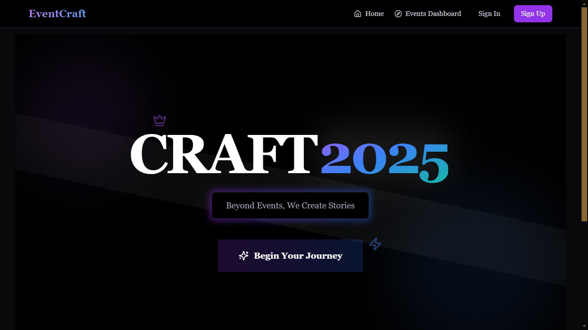
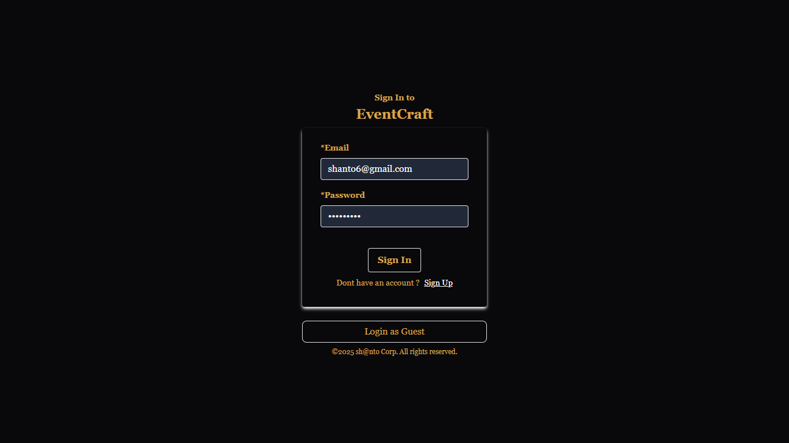
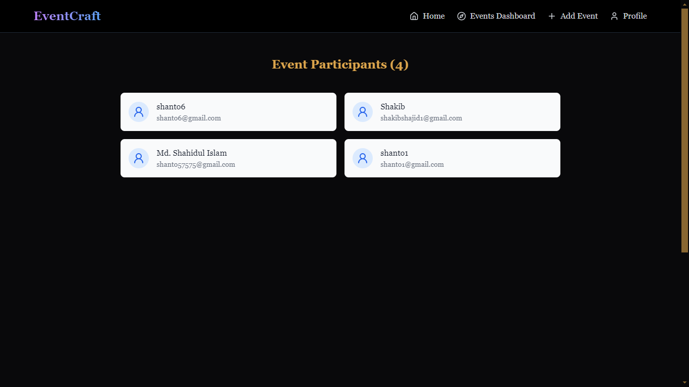
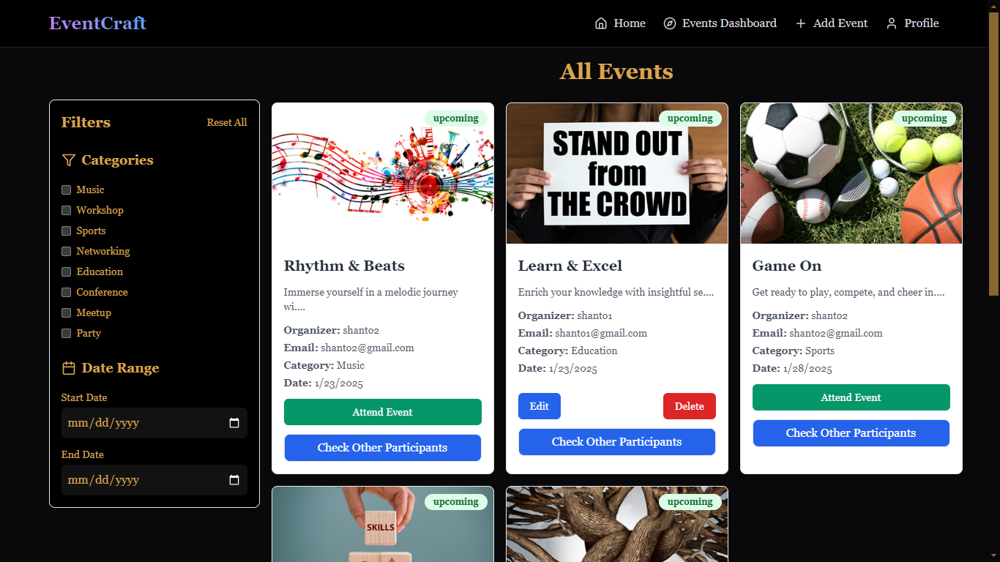

# EventCraft - Event Management Platform

EventCraft is a full-stack event management platform where users can create, manage, and view events. The platform supports real-time updates for attendees and is fully responsive for seamless usage across devices.

---

## Features

### Frontend

1. **User Authentication**:
   - Register, log in, and guest login options.
2. **Event Dashboard**:
   - View upcoming and past events.
   - Filters for categories and dates.
3. **Event Creation**:
   - Create events with details like name, description, date/time, and more.
4. **Real-Time Attendee List**:
   - Display attendee counts in real-time using Socket.IO.
5. **Responsive Design**:
   - Works seamlessly on desktop, tablet, and mobile devices.

### Backend

1. **Authentication API**:
   - Secure authentication using JWT.
2. **Event Management API**:
   - Full CRUD operations for events with ownership restrictions.
3. **Real-Time Updates**:
   - WebSockets implemented via Socket.IO.
4. **Database**:
   - Efficient storage of event and user data using MongoDB Atlas.

---

## Tech Stack

### Frontend

- `React.js`
- `react-router-dom` (Routing)
- `react-hook-form` (Form Handling)
- `axios` (HTTP Requests)
- `react-hot-toast` (Notifications)
- `socket.io-client` (Real-time communication)
- `tailwindcss` (Styling)
- `lucide-react` (Icons)

### Backend

- `Node.js with Express.js`
- `bcrypt` (Password hashing)
- `cloudinary` (Image hosting)
- `cors` (Cross-Origin Resource Sharing)
- `dotenv` (Environment variable management)
- `express-rate-limit` (Rate limiting for security)
- `jsonwebtoken` (Authentication)
- `mongoose` (MongoDB ODM)
- `multer` (File uploads)
- `socket.io` (WebSockets for real-time communication)

### Deployment

- **Frontend**: [Netlify](https://eventcraft99.netlify.app)
- **Backend**: [Render](https://eventcraft-5ygi.onrender.com)
- **Database**: MongoDB Atlas
- **Image Hosting**: Cloudinary

---

## Project Structure

```plaintext
root
├── frontend
│   ├── public
│   ├── src
│   │   ├── components
│   │   ├── pages
│   │   ├── hooks
│   │   ├── utils
│   ├── package.json
│   └── ...
├── backend
│   ├── routes
│   │   ├── user.route.js
│   │   ├── event.route.js
│   ├── controllers
│   ├── middleware
│   ├── models
│   ├── utils
│   ├── package.json
│   └── ...
├── .env
└── README.md
```

---

## API Endpoints

### User Routes

| Method | Endpoint                | Description                    |
| ------ | ----------------------- | ------------------------------ |
| POST   | `/api/auth/create-user` | Register a new user            |
| POST   | `/api/auth/login-user`  | Log in an existing user        |
| POST   | `/api/auth/guest-login` | Guest login for limited access |
| GET    | `/api/auth/get-user`    | Fetch user details             |

### Event Routes

| Method | Endpoint                     | Description        |
| ------ | ---------------------------- | ------------------ |
| POST   | `/api/event/create-event`    | Create a new event |
| POST   | `/api/event/attend/:eventId` | Attend an event    |
| GET    | `/api/event/all-event`       | Fetch all events   |
| GET    | `/api/event/:id`             | Fetch event by ID  |
| PUT    | `/api/event/:id`             | Update event by ID |
| DELETE | `/api/event/:id`             | Delete event by ID |

---

## Running Locally

### Prerequisites

Ensure you have the following installed:

- Node.js
- npm
- MongoDB (or use MongoDB Atlas)

### Steps

1. Clone the repository:
   ```bash
   git clone https://github.com/Shanto57575/eventCraft
   ```
2. Navigate to the project folder:
   ```bash
   cd frontend
   ```
3. Install dependencies for the frontend:
   ```bash
   npm install
   npm run dev
   ```
4. Open another terminal and navigate to the backend:
   ```bash
   cd backend
   ```
5. Install dependencies for the backend:
   ```bash
   npm install
   npm run dev
   ```
6. The application should now be running locally.

---

## Environment Variables

Create a `.env` file in the root directory of the backend with the following:

```env
PORT=3000
MONGO_URI=<Your MongoDB Atlas URI>
JWT_SECRET=<Your JWT Secret>
CLOUDINARY_NAME=<Your Cloudinary Name>
CLOUDINARY_API_KEY=<Your Cloudinary API Key>
CLOUDINARY_API_SECRET=<Your Cloudinary API Secret>
```

---

## Live URLs

- **Frontend**: [EventCraft Frontend](https://eventcraft99.netlify.app)
- **Backend**: [EventCraft Backend](https://eventcraft-5ygi.onrender.com)

---

## Test User Credentials

`Email` : test@gmail.com

`password` : Test@123

## Deployment Steps

### Frontend

1. Deploy the frontend to Netlify:
   - Select the `frontend` folder.
   - Build command: `npm run build`
   - Publish directory: `dist`

### Backend

1. Deploy the backend to Render:
   - Create a new web service.
   - Connect your GitHub repository.
   - Select the `backend` folder.
   - Build command: `npm install`
   - Start command: `npm start`

---

## Screenshots






---

## Author

Developed by **Shanto**.
